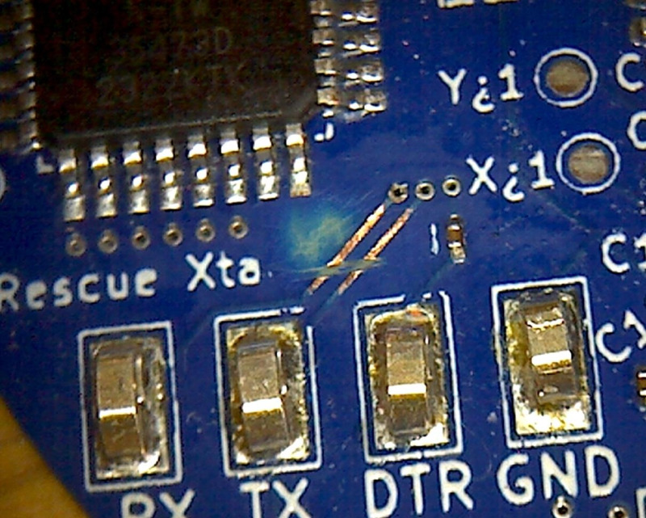
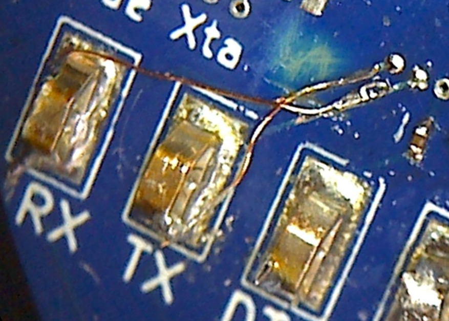

# ERRATA

## PCB v0.3a
The RX and TX lines are mislabeled on the serial programming interface,
and the connections to the CH340 are incorrect.

### Solution
If you're programming with a serial cable, just swap RX and TX (connect RX on your cable to RX on the board, and vice versa).

To get USB programming working, cut the connections above the RX/TX attachment loops and connect them to the vias just above with bodge wires.

To get more to solder to, you can carefully sand the soldermask down. I used 240 grit sand paper to good effect. Be very careful not to desolder or damage the capacitor nearby.

