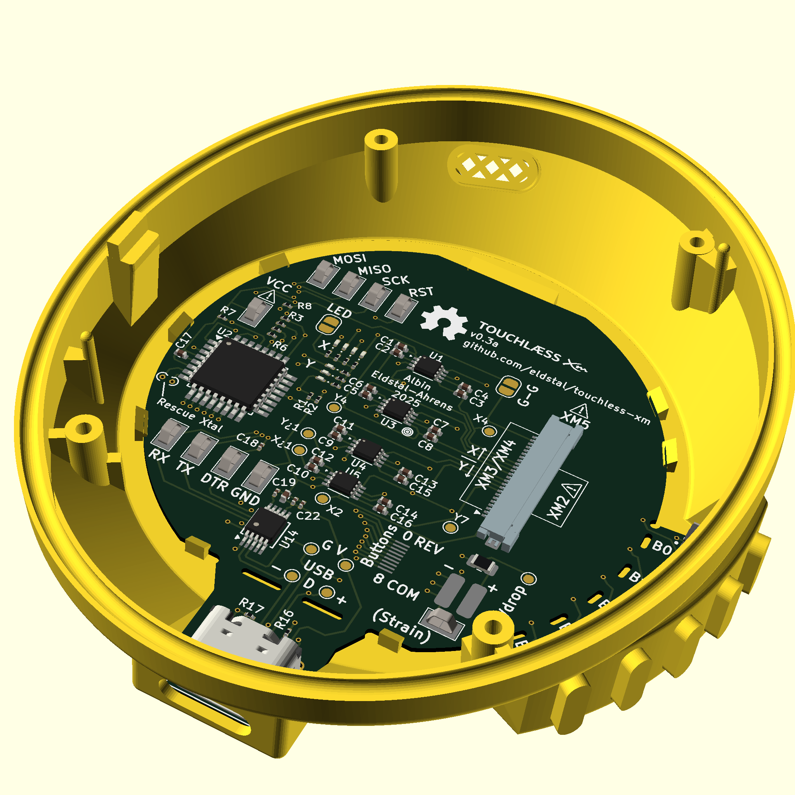
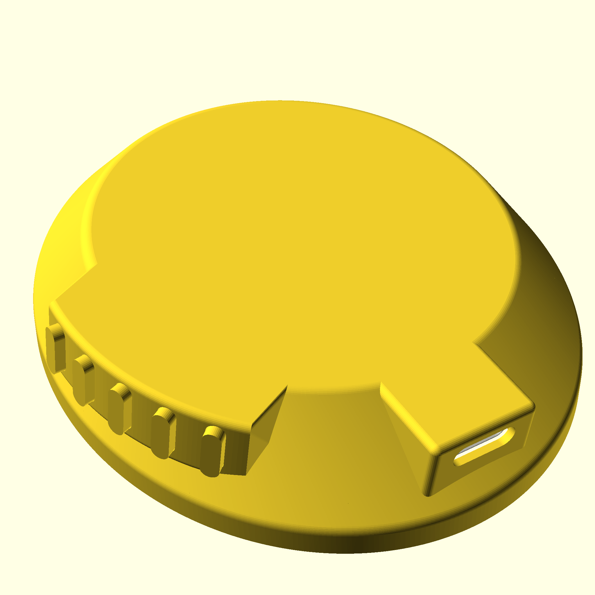

# Touchlæss XM

A mod for Sony WH-1000XM2 (experimental), WH-1000XM3, WH-1000XM4 and WH-1000XM5 (experimental) headphones to remove the gesture-based touch controls and add physical buttons.

- [Project Status](#Status)
- [Compatible headsets](#compatibility)
- [Modifications](#modifications)
- [How to program your board](#how-to-program)
- [Notes on ordering PCBs](#fabrication-notes)
- [License](#license)

 

## Status
The project is not yet ready for use.

### Case
The design has been 3D-printed and test fit against an XM4 headset. The button design and PCB fastening are still undergoing work. The mic grill looks good but prints awful.
Could be that we need to use a metal mesh inserted during the print.

STLs will be available both with and without USB ports.

### PCB
v0.3a of the board has been manufactured and will be programmed/tested ASAP.

### Firmware
Mostly ready for testing. USB support (only for programming) is already included in the main board. The project uses platform.io and OptiBoot to run an Arduino-based firmware.


## Compatibility
I only have a pair of XM4 to test with, so the design is made to fit them. The connector is a 24-pin, but only XM5 has a cable that wide. For other models, insert your narrower cable carefully to match the lines on the PCB.

### 🟡 Sony WH-1000XM2 (Experimental)
I've laid out the board for experimental support for the XM2. These are the most different out of the bunch, so there are caveats.

⚠️**WARNING**⚠️
The OEM cable will not work, because the XM2 has the touch board's connector at the front. You will need a slightly longer cable **with opposite side contacts**. Possibly [This Würth 687712100002](https://eu.mouser.com/ProductDetail/Wurth-Elektronik/687712100002?qs=PhR8RmCirEbjmYLiy2w9eg%3D%3D) is suitable, but too long of a cable will cause interference. If you can trim it to length, that will improve the chances of success.

There is no bespoke connector for the XM2, you need to very carefully position it in the larger connector using the lines on the PCB.

It's also necessary to modify the firmware pin map slightly, since the Y pins are in the opposite order. Use `--environment xm2` when you compile the firmware.

If you've got a pair of XM2s and want to help me tune the compatibility, let me know!

### 🟡 Sony WH-1000XM3 (Probably compatible)
The XM3 touch board and battery connector appear to be electrically identical to XM4, so the PCB should be compatible. A different case design may be needed.

Insert your cable all the way at the top of the connector (there will be two unused pins at the bottom). Follow the lines in the silkscreen for guidance.


### 🟢 Sony WH-1000XM4 (Compatible)
The project is designed for these, so these will be the ones primarily tested. The OEM touch board has a flat cable which Touchlæss is designed to reuse.

Insert your cable all the way at the top of the connector (there will be two unused pins at the bottom). Follow the lines in the silkscreen for guidance.

The battery uses a 2-pin JST ZH series connector. There is no vertical space inside the case for a matching connector on the board, so I've resorted to soldering a Y-connector onto the Touchlæss pcb. Separate from the PCB BOM, you'll need one male and one female JST ZH-2 connector and some red/black cables.


### 🟡 Sony WH-1000XM5 (Possibly compatible)
Experimental support is included in the initial board design, but I **do not** own a pair of XM5 and cannot test them. The XM5 pinout is entirely based on reverse-engineering of photos, so I may have made a mistake! The Touchless board shouldn't be able to do any damage to the headphones. If you have a pair of XM5s and would like to help me test the compatibility, feel free to reach out!

At a minimum, the XM5 OEM design doesn't include a loose cable for us to reuse. You will need a suitable flat cable, which is 24-pin FFC with 0.5mm pitch and same-side connectors. [This Würth 687624050002](https://eu.mouser.com/ProductDetail/Wurth-Elektronik/687624050002?qs=P%2FTEqz%252BQfndQFFKLalvVUA%3D%3D) should work, but may not be the proper length.

The battery connector for XM5 is also different, a 3-pin of unknown design. If you have more information about this, let me know!

### 🟡 Sony WH-1000XM6 (Not even released yet)
With any luck, the XM6 touch board will be similar to the XM5. It will be a while before I get my hands on a new high-end headset to test it, though.

If you're getting a pair of XM6 and would like to send me some nice photos of the internals, I'll be very grateful!

### 🔴 Other manufacturers/headsets
**Highly** unlikely. At the very least, you'll need to figure out the pinout for the touch sensor board. Most likely there will be other things that need tuning as well. If you want to make something like touchless for a different headset, take a look at the [technical documentation](doc/README.md) for some pointers on how Touchless works.


## Modifications

#### I don't want another USB port on my headset
That's OK, it's only needed for development (reprogramming the Touchless board without disassembling the headphones). Simply snap the USB connector off from the main board (see perforations) and print yourself a case without a USB block. Set `cap_type=nousb` in `xm4-cap.scad` to get a case that's closed at the bottom.


#### I don't like how you've placed the buttons
That's no problem! Snap the button portion off of the main board (see perforations) and use the solder points on the front or back to connect your own buttons placed wherever you want them. If you're keen on PCB design, it's not that hard to redesign the PCB for button placement (or add/remove buttons as needed).

There is no need for external resistors etc, just connect a switch between one button contact and the COM and you're good to go.


#### I don't have a 3D printer
No problem! If you remove the buttons and the USB addition (see above), the touchless board should fit inside the OEM ear cup (you have to remove the original touch board first, which may be destructive). Make cuts in the case as needed to mount buttons where you want them, and wire them up to the exposed button solder points on the front or back of the PCB.


#### The case is fine, but I want to reconfigure the buttons
Easiest way to do this is in the firmware. Take a look at [buttonmap.cpp](firmware/tobo/src/buttonmap.cpp) to switch and swap however you like. You'll need the included USB port or a serial cable to program the board after you've made your modifications. Instructions are [down below](#step-2-firmware).

#### I want to design my own case
Great! You can find the dimensions of the PCB [here](doc/tobo-measurements.svg). It's all  relative to the center of the circular area, so if your CAD program supports polar coordinates you'll have an easier time of it. You may also have use for `make vrml` in the pcb directory, which creates a VRML 3D export of the PCB to use as a reference in your model.

#### I want buttons for other features
That won't be possible, sorry. Touchlæss only works by simulating touches and swipes, so it can only do what the headphones allow you to do with the touch panel.


#### The buttons are too slow!
Yes. There is a significant delay between pushing a button and the headset responding. This isn't something we can control, since Touchlæss simulates touch gestures. If a swipe takes 120ms to perform, the headset can't react sooner than that.


#### I want the buttons on the left cup
That will be an adventure. Touchlæss interfaces with the board in the right cup, so you'll need to run wires across the headband to get to the other side. Not impossible, but certainly a lot of work.


#### I want to make and sell these
That's great! I won't ask for any royalties or whatever. If you do set something up, I'm happy to include a link here so people can buy from you.

## How to program

⚠️**WARNING**⚠️ The VCC loop on the PCB is directly connected to the headphone battery. **Do not** connect an external supply to this hook while the battery is connected. It is only needed in order to program and test the board without a headset connected.

### Step 1: Bootloader
**This only needs to be done once per board**

When you have a fresh board with a factory-stock microcontroller, you'll have to start with the bootloader. For this step you need a hardware AVR programmer, for example:

- AVRISPmk2 (tested, works)
- An Arduino ([Instructions](https://docs.arduino.cc/built-in-examples/arduino-isp/ArduinoISP/#how-to-wire-your-boards))
- A [Bus Pirate](http://www.dangerousprototypes.com/docs/Bus_Pirate_AVR_Programming)
- An [USBAsp](https://www.fischl.de/usbasp/)

...or anything else supported by avrdude or [platform.io](https://platformio.org/). Install [the platform.io tools](https://platformio.org/install/cli) and let's go!

1. Connect your programmer to MISO, MOSI, SCK, GND and RST.
2. Connect **either** the battery or the VCC terminal


| tobo | AVRISP 10-pin |Glasgow | BP harness |
|------|---------------|--------|------------|
| MOSI | 1             | PURP   | 2 Red
| VCC  | 2             | ORG    | 1 Brown
| RST  | 5             | YEL    | 6 Blue
| SCK  | 7             | PINK   | 8 Grey
| MISO | 9             | BRN    | 10 Black
| GND  | 10            | B/W    | 3 Pink

Add the needed environment to `firmware/tobo/platformio.ini` to use your programmer.

**Warning** Ensure that your new environment extends `env:tobo`, so that the frequency and fuses are programmed properly. If you do not, you may need to temporarily connect an external crystal (see PCB markings) in order to recover the board.

```
cd firmware/tobo
pio run --environment avrispv2 --target bootloader
```

If there are no errors, congratulations! Your tobo board is an Arduino! You're ready for the next step.

### Step 2: Firmware
**If you've made changes to the code and want to update your board, this step is the only one you need to repeat**

If your board has the bootloader installed, you can put your ISP programmer away and use either the on-board USB port or your own serial adapter. This can be an FTDI cable, a different USB-to-serial adapter, or an arduino board with no microcontroller.

Hook up your serial cable to the tobo:

| tobo | serial adapter |
|------|----------------|
| RX | TX |
| TX | RX |
| GND | GND |
| DTR | DTR (if your cable has it) |
| RST | RST (if using an arduino) |
| VCC  | VCC **Only if you don't have the battery plugged in**|


```
cd firmware/tobo
pio run --target upload
```

If all went well, you're ready to go!

## Fabrication Notes
I'm currently in the process or ordering a first batch of boards from PCBWay. These are caveats of the design:

- Order a 0.6mm PCB, to maximize the clearance inside the cap
- The smallest drilled hole is just over 0.2mm
- The XM4/XM5 connector footprints have narrow spacing between pads. This is a problem for the "Matte black" solder mask, but apparently possible with green/blue/red solder mask. If you want a matte black board, you have to allow for gaps in the solder mask at these connectors, and that may lead to shorts. Go with green or blue or red.

## License
Touchlæss XM © 2025 by Albin Eldstål-Ahrens is licensed under Creative Commons BY-SA 4.0 

This means you are free to use, modify, distribute, remix, redesign the project however you wish as long as you
1. Credit the original work where relevant
2. Release your own modified work under a similar CC license

If you want to make and sell kits of this, feel free! If you make money from my work, please consider making a donation to a charitable organization as a thank you!
