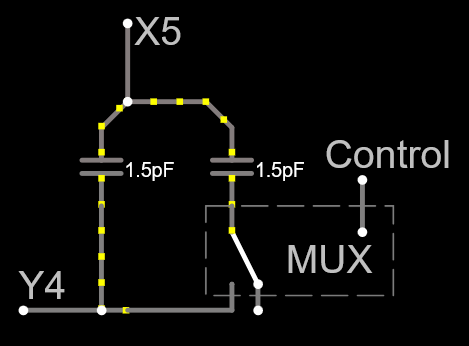

# Technical docs

## How does it work?

All three XM* headsets use the same basic principle for their touch controls, a grid of pads arranged in rows (Y) and columns (X). A pair of one X and one Y pad make up a single cell of a [mutual capacitive touch](https://www.elektormagazine.com/articles/how-do-capacitive-touch-sensors-work) matrix.

The controller board in the headphones uses various analog tricks to measure the capacitance of each X/Y pair, one at a time. When a finger is near, the capacitance between the pads **drops**.


### How does Touchless simulate this?

The easy and "safe" way to replace the touch board is to simulate the drop in capacitance, rather than trying to emulate the resulting analog signal. Touchless does this by connecting two capacitors between an X pad and a Y pad, and having one of the two capacitors connected via a multiplexer. This allows us to cut the capacitance in half by breaking the circuit, simulating a touch event.




To support swiping motions, Touchless attaches to four horizontal and four vertical points in the touch matrix. This lets us control touch events at the following coordinates: 

```
-     -     -     -     -     -
-     -     -     -     -     -
-   (1,4) (2,4) (3,4) (4,4)   -
-     -     -   (3,5)   -     -
-     -     -   (3,6)   -     -
-     -     -   (3,7)   -     -
-     -     -     -     -     - 
-     -     -     -     -     -
```

Prototype testing indicates that three points are enough for a working swipe on the XM4, so this should be sufficient for all gestures.


## Original hardware
### WH1000-XM2


#### Battery connector
Battery appears to be a cellphone-type with no cables attached to it. It sits in a cradle which *does* have a cable+connector to the board, though.


It's a 3-pin, likely JST but does not match the XM4 or XM5.


#### Touch board connector
FCC filing contains an OK shot of the touch board. The connector is at the front!

Pin 12 toward the top of the PCB/cap

| Pin  | Name |
|------|------|
|  12  |  ?   |
|  11  |  X4  |
|  10  |  X3  |
|   9  |  X2  |
|   8  |  X1  |
|   7  |  X0  |
|   6  |  NC  |
|   5  |  Y3  |
|   4  |  Y2  |
|   3  |  Y1  |
|   2  |  Y0  |
|   1  |  ?   |

Because the headphones have their connector at the front and tobo has its connector at the rear, you'll need a cable with **opposite side** connectors (i.e. exposed connectors on the front on one end and on the back on the other end). The cable also needs to be a bit longer than the OEM one.

### WH1000-XM3

Connectors (based on photos) appear to be identical to WH1000-XM4.


### WH1000-XM4


#### Battery connector
This is a 2-pin [JST ZH-series connector](https://www.jst-mfg.com/product/pdf/eng/eZH.pdf). The matching board connector is too tall to fit on the Touchless board, so the current design has no connector. Solder bare wires to the pcb and run them through a test loop for strain relief.

#### Touch board connector

FFC-22 with a 0.5mm pitch. With pin 22 at the top of the touch board, this is the pinout:

| Pin  | Name |
|------|------|
|  22  |  Some sort of ground loop around the edge |
|  21  |  GND |
|  20  |  NC  |
|  19  |  Unknown  |
|  18  |  X6  |
|  17  |  X5  |
|  16  |  X7  |
|  15  |  X8  |
|  14  |  X4  |
|  13  |  X3  |
|  12  |  X2  |
|  11  |  X1  |
|  10  |  X0  |
|  9   |  Y4  |
|  8   |  Y5  |
|  7   |  Y6  |
|  6   |  Y7  |
|  5   |  Y8  |
|  4   |  Y3  |
|  3   |  Y0  |
|  2   |  Y1  |
|  1   |  Y2  |


A compatible-ish part with a low profile is [Molex 545482272](https://www.molex.com/en-us/products/part-detail-pdf/545482272?display=pdf)


### WH1000-XM5

**This info is based on photos found online** and not from actual measurements on the real headset. Don't trust these numbers.

#### Battery connector
3-pin of unknown model. For sure not compatible with the XM4.

Inserted part seems to be ~7.3mm wide and inserted to 4mm depth.
The outer terminals are about 4mm apart, and there's a single smaller pin for the temp sensor.

It's labeled JST, and the closest I've been able to find is the [LBT-A](https://www.jst.com/products/crimp-style-connectors-wire-to-board-type/lbt-connector-a-type/), probably model `LBTAR-03V-2K-K(HF)`


#### Touch board connector
24-pin 0.5mm pitch FPC integrated in the touch board (no connector on that end).

Touch panel is an FPC and has no connector of its own, the cable is combined with the circuit board itself. This pinout is for an imaginary connector, if you were to replace the FPC with a PCB and use a straight 24-pin FFC cable from the motherboard to the touch panel.

A suitable connector might be [Molex 545482472](https://www.molex.com/en-us/products/part-detail-pdf/545482472?display=pdf).

Pin 24 is at the top, 1 is at the bottom.

| Pin  | Name |
|------|------|
|  24  | Some kind of ground loop around the board  |
|  23  | GND  |
|  22  | NC   |
|  21  | X0   |
|  20  | X6   |
|  19  | X5   |
|  18  | X7   |
|  17  | X8   |
|  16  | X4   |
|  15  | X3   |
|  14  | X2?  |
|  13  | X1?  |
|  12  | NC   |
|  11  | Y4   |
|  10  | Y5   |
|  9   | Y6   |
|  8   | Y7   |
|  7   | Y8   |
|  6   | Y3   |
|  5   | Y9   |
|  4   | Y10  |
|  3   | Y2   |
|  2   | Y1   |
|  1   | Y0   |

The current PCB design for Touchless has an XM5 connector, which is based on this presumed pinout. If you have an XM5 headset and can provide a pinout, please let me know!